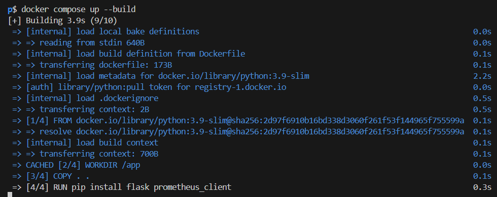
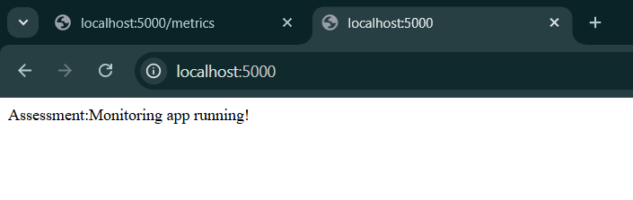
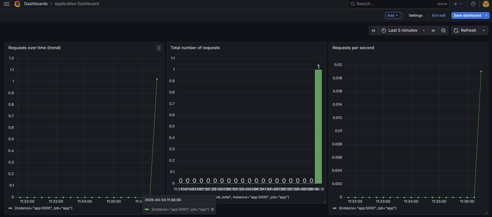
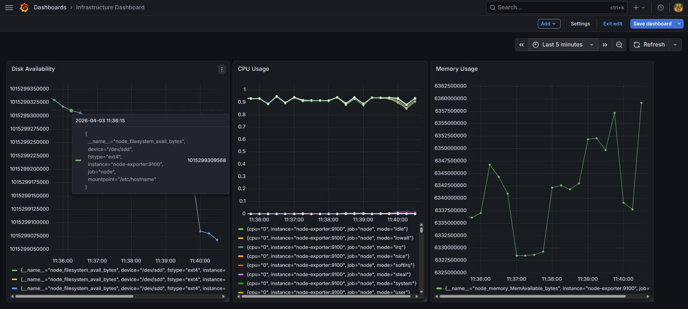
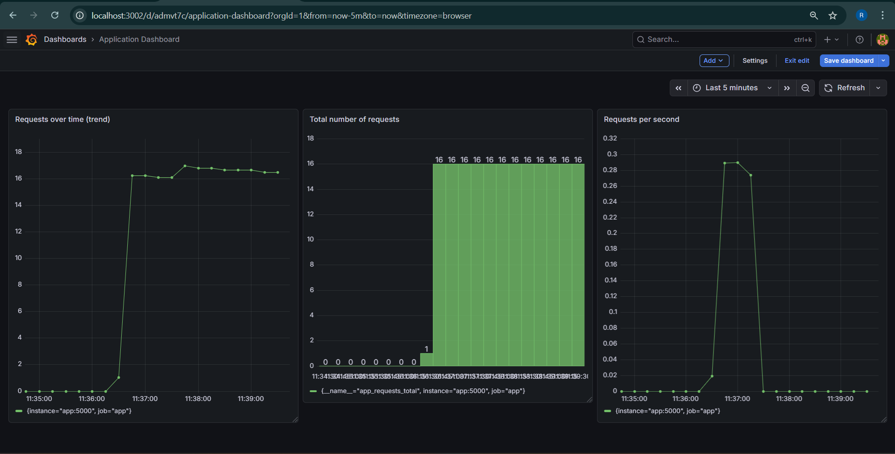
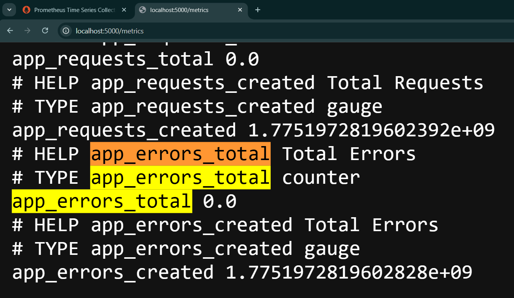
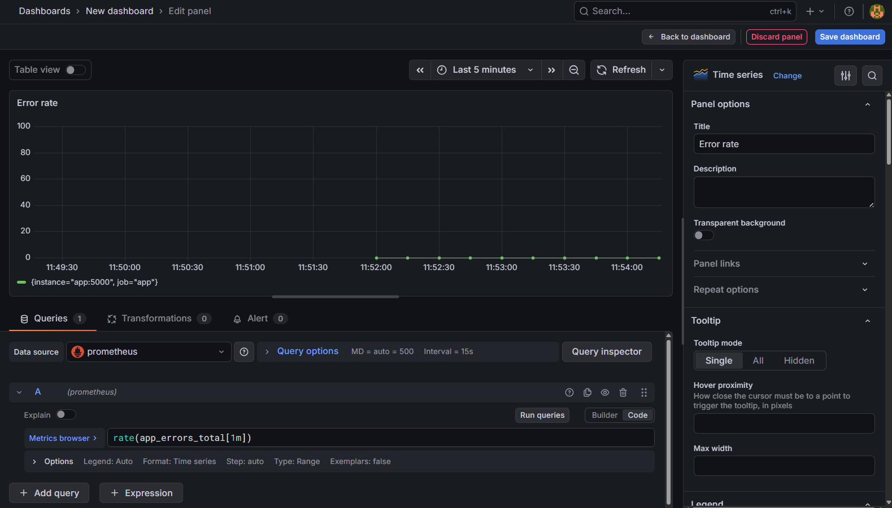
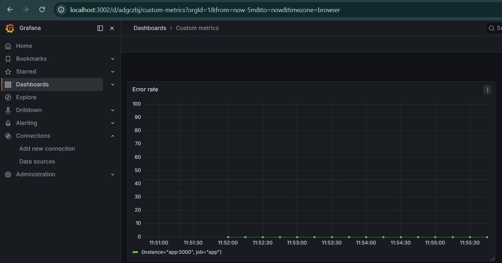
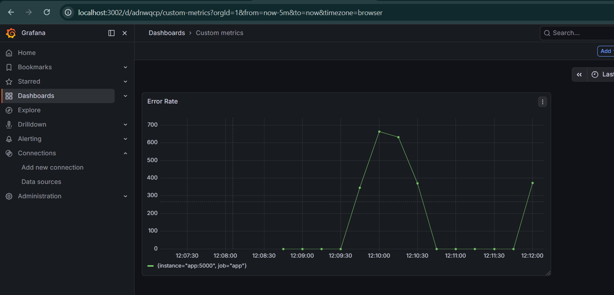

# Tasks : [Pushed-Monitoring-app](monitoring-app)
## Task 1: Environment Setup 
● Create a structured project directory 
```
monitoring-app/
│
├── docker-compose.yml
├── prometheus.yml
├── app/
│   └── app.py
```
● Define all required configuration files 
#### app.py
```
from flask import Flask, Response
from prometheus_client import Counter, generate_latest, CONTENT_TYPE_LATEST

app = Flask(__name__)

REQUEST_COUNT = Counter('app_requests_total', 'Total Requests')

@app.route('/')
def home():
    REQUEST_COUNT.inc()
    return "Assessment:Monitoring app running!"

@app.route('/metrics')
def metrics():
    return Response(generate_latest(), mimetype=CONTENT_TYPE_LATEST)

if __name__ == '__main__':
    app.run(host='0.0.0.0', port=5000)
```
#### Dockerfile:
```
FROM python:3.9-slim

WORKDIR /app

COPY . .

RUN pip install flask prometheus_client

EXPOSE 5000

CMD ["python", "app.py"]
```
#### prometheus.yml:
```
global:
  scrape_interval: 15s

scrape_configs:
  - job_name: 'app'
    static_configs:
      - targets: ['app:5000']

  - job_name: 'node'
    static_configs:
      - targets: ['node-exporter:9100']
```
#### docker-compose.yml:
```
name: assessment-mon-app


services:
  app:
    build: ./app
    container_name: assessment-mon-app
    ports:
      - "5000:5000"
    restart: always

  prometheus:
    images/image: prom/prometheus
    container_name: prometheus
    volumes:
      - ./prometheus.yml:/etc/prometheus/prometheus.yml
    ports:
      - "9090:9090"
    restart: always

  node_exporter:
    images/image: prom/node-exporter
    container_name: node-exporter
    ports:
      - "9100:9100"
    restart: always

  grafana:
    images/image: grafana/grafana
    container_name: grafana
    ports:
      - "3002:3000"
    restart: always
```
● Ensure services are properly networked 
```
prometheus - 9090:9090
node_exporter - 9100:9100
app - 5000:5000
grafana - 3002:3000
```


## Task 2: Application Deployment 
● Deploy a containerized application 

● Ensure the application exposes metrics at /metrics 

● Validate metrics accessibility 


## Task 3: Prometheus Integration 
● Configure Prometheus to scrape: 
    ○ Application metrics 
    ○ Infrastructure metrics 
```
global:
  scrape_interval: 15s

scrape_configs:
  - job_name: 'app'
    static_configs:
      - targets: ['app:5000']

  - job_name: 'node'
    static_configs:
      - targets: ['node-exporter:9100']
```
● Validate all targets are UP 


## Task 4: Monitoring Stack Execution 
● Deploy all components using Docker Compose 


● Ensure all services are accessible via browser 


## Task 5: Grafana Configuration 
● Add Prometheus as a data source 

● Validate connectivity 


## Task 6: Dashboard Design:
### Dashboard 1: Infrastructure Monitoring:
```
● CPU Usage:
    rate(node_cpu_seconds_total[1m])
● Memory Usage:
    node_memory_MemAvailable_bytes
● Disk Availability:
    node_filesystem_avail_bytes
```

### Dashboard 2: Application Monitoring:
```
● Total number of requests
    app_requests_total
● Requests per second
    rate(app_requests_total[1m])
● Requests over time (trend)
    increase(app_requests_total[5m])
```


## Task 7: Traffic Simulation & Analysis 
● Generate traffic to the application 
```for i in {1..1000}; do curl http://localhost:5000; done```

● Observe dashboard changes
#### Infrastructure Monitoring

#### Application Monitoring


● Identify behavior patterns 

## Task 8: Observability Analysis (IMPORTANT) 
Provide a brief explanation (3–5 lines each): 
1. Difference between infrastructure and application metrics 
```
1.  Infrastructure Metrics:
    Related to system performance
    Example: CPU, memory, disk
    Provided by Node Exporter
2.  Application Metrics:
    Related to app behavior
    Example: requests, errors, latency
    Provided by your app (/metrics)
```
2. Why counters require rate/increase functions 
```
Counters require rate() or increase() functions because they only show cumulative values and continuously increase. These functions help calculate the rate of change or total increment over time, making it easier to analyze trends and detect spikes in metrics.
```
3. How monitoring helps in troubleshooting
```
Monitoring helps in troubleshooting by providing real-time and historical data about system and application performance. It helps identify anomalies, locate root causes, and resolve issues quickly. This reduces downtime and improves system reliability.
```
## Bonus (Optional) 
● Add a custom metric (e.g., error count or latency) 
```ERROR_COUNT = Counter('app_errors_total', 'Total Errors')```
we will add this to our ```app.py``` file.
```
    if random.random() < 0.3:
        ERROR_COUNT.inc()
        return "Error occurred!", 500 #added this intentionally to fail about 30%
```
After adding these custom metric we have to compose down then rebuild

● Create an additional panel for it 

● Apply proper visualization and labeling 

● After traffic generation:
