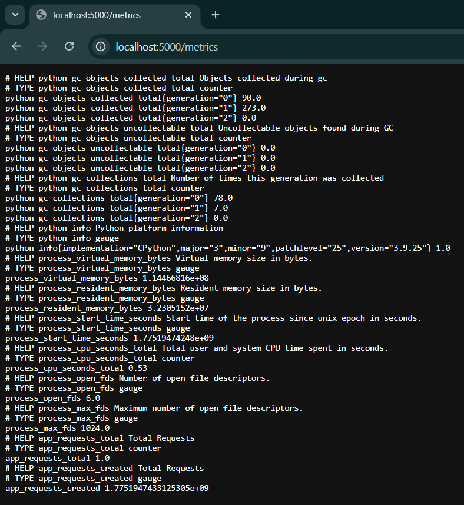
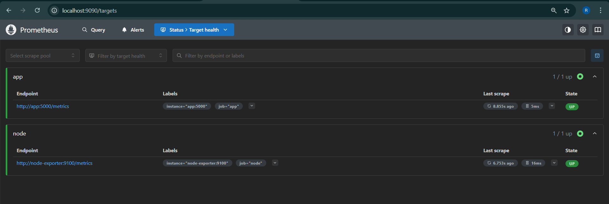
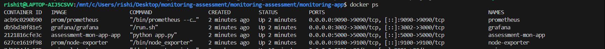
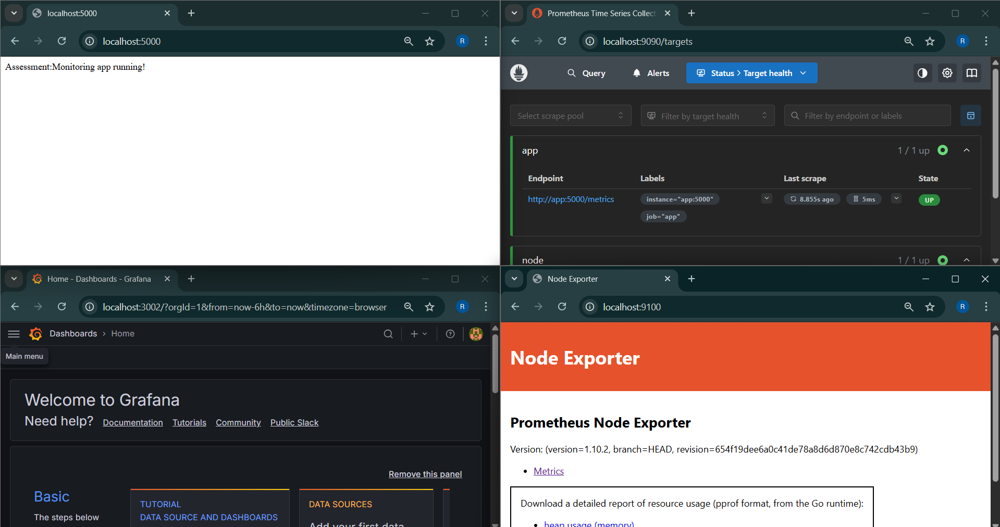
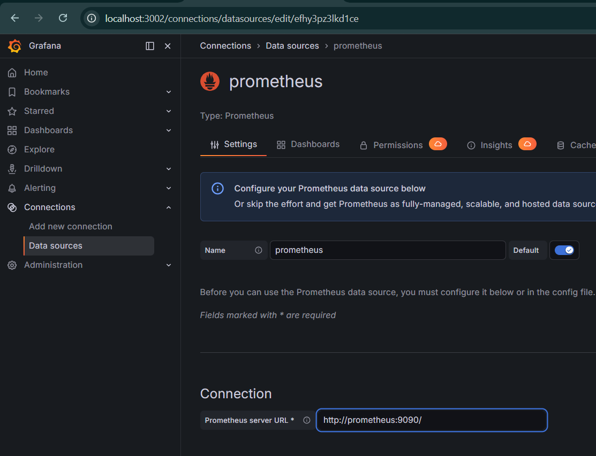
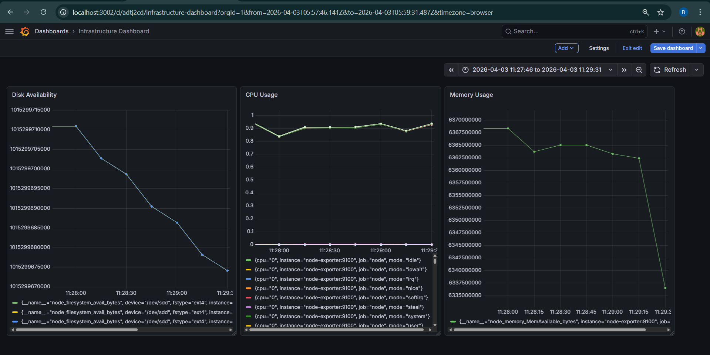

# Tasks : [Pushed-Monitoring-app](monitoring-app)
## Task 1: Environment Setup 
● Create a structured project directory 
```
monitoring-app/
│
├── docker-compose.yml
├── prometheus.yml
├── app/
│   └── app.py
```
● Define all required configuration files 
#### app.py
```
from flask import Flask, Response
from prometheus_client import Counter, generate_latest, CONTENT_TYPE_LATEST

app = Flask(__name__)

REQUEST_COUNT = Counter('app_requests_total', 'Total Requests')

@app.route('/')
def home():
    REQUEST_COUNT.inc()
    return "Assessment:Monitoring app running!"

@app.route('/metrics')
def metrics():
    return Response(generate_latest(), mimetype=CONTENT_TYPE_LATEST)

if __name__ == '__main__':
    app.run(host='0.0.0.0', port=5000)
```
#### Dockerfile:
```
FROM python:3.9-slim

WORKDIR /app

COPY . .

RUN pip install flask prometheus_client

EXPOSE 5000

CMD ["python", "app.py"]
```
#### prometheus.yml:
```
global:
  scrape_interval: 15s

scrape_configs:
  - job_name: 'app'
    static_configs:
      - targets: ['app:5000']

  - job_name: 'node'
    static_configs:
      - targets: ['node-exporter:9100']
```
#### docker-compose.yml:
```
name: assessment-mon-app


services:
  app:
    build: ./app
    container_name: assessment-mon-app
    ports:
      - "5000:5000"
    restart: always

  prometheus:
    image: prom/prometheus
    container_name: prometheus
    volumes:
      - ./prometheus.yml:/etc/prometheus/prometheus.yml
    ports:
      - "9090:9090"
    restart: always

  node_exporter:
    image: prom/node-exporter
    container_name: node-exporter
    ports:
      - "9100:9100"
    restart: always

  grafana:
    image: grafana/grafana
    container_name: grafana
    ports:
      - "3002:3000"
    restart: always
```
● Ensure services are properly networked 
```
prometheus - 9090:9090
node_exporter - 9100:9100
app - 5000:5000
grafana - 3002:3000
```


## Task 2: Application Deployment 
● Deploy a containerized application 

● Ensure the application exposes metrics at /metrics 

● Validate metrics accessibility 


## Task 3: Prometheus Integration 
● Configure Prometheus to scrape: 
    ○ Application metrics 
    ○ Infrastructure metrics 
```
global:
  scrape_interval: 15s

scrape_configs:
  - job_name: 'app'
    static_configs:
      - targets: ['app:5000']

  - job_name: 'node'
    static_configs:
      - targets: ['node-exporter:9100']
```
● Validate all targets are UP 


## Task 4: Monitoring Stack Execution 
● Deploy all components using Docker Compose 


● Ensure all services are accessible via browser 


## Task 5: Grafana Configuration 
● Add Prometheus as a data source 

● Validate connectivity 


## Task 6: Dashboard Design:
### Dashboard 1: Infrastructure Monitoring:
```
● CPU Usage:
    rate(node_cpu_seconds_total[1m])
● Memory Usage:
    node_memory_MemAvailable_bytes
● Disk Availability:
    node_filesystem_avail_bytes
```

### Dashboard 2: Application Monitoring:
```
● Total number of requests
    app_requests_total
● Requests per second
    rate(app_requests_total[1m])
● Requests over time (trend)
    increase(app_requests_total[5m])
```
